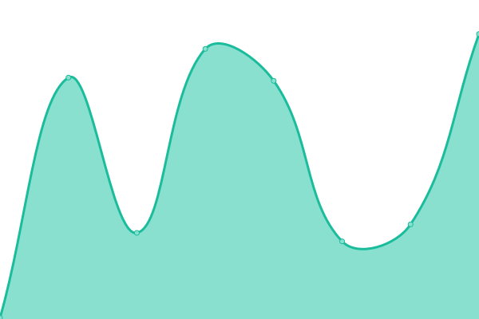

# [📈 Live Status](https://demo.upptime.js.org): <!--live status--> **🟧 Partial outage**

This repository contains the open-source uptime monitor and status page for [Maxi Vecchio](https://demo.upptime.js.org), powered by [Upptime](https://github.com/upptime/upptime).

With [Upptime](https://upptime.js.org), you can get your own unlimited and free uptime monitor and status page, powered entirely by a GitHub repository. We use [Issues](https://github.com/maxivecchio/upptime/issues) as incident reports, [Actions](https://github.com/maxivecchio/upptime/actions) as uptime monitors, and [Pages](https://demo.upptime.js.org) for the status page.

<!--start: status pages-->
<!-- This summary is generated by Upptime (https://github.com/upptime/upptime) -->
<!-- Do not edit this manually, your changes will be overwritten -->
<!-- prettier-ignore -->
| URL | Status | History | Response Time | Uptime |
| --- | ------ | ------- | ------------- | ------ |
|  [MoveUp - Main Site](https://moveup.digital) | 🟩 Up | [move-up-main-site.yml](https://github.com/maxivecchio/upptime/commits/HEAD/history/move-up-main-site.yml) | 

 299ms
     
 | 

<a href="https://status.moveup.digital/history/move-up-main-site">100.00%</a>
    

|  [Benito Fernandez (official site)](https://benitofernandez.com.ar) | 🟩 Up | [benito-fernandez-official-site.yml](https://github.com/maxivecchio/upptime/commits/HEAD/history/benito-fernandez-official-site.yml) | 

 537ms
     
 | 

<a href="https://status.moveup.digital/history/benito-fernandez-official-site">100.00%</a>
    

|  [Benito Fernandez (preview)](https://benito.preview.moveup.digital) | 🟩 Up | [benito-fernandez-preview.yml](https://github.com/maxivecchio/upptime/commits/HEAD/history/benito-fernandez-preview.yml) | 

 201ms
     
 | 

<a href="https://status.moveup.digital/history/benito-fernandez-preview">100.00%</a>
    

|  [ClassHome](https://classhome.com.ar) | 🟩 Up | [class-home.yml](https://github.com/maxivecchio/upptime/commits/HEAD/history/class-home.yml) | 

 1010ms
     
 | 

<a href="https://status.moveup.digital/history/class-home">100.00%</a>
    

|  [Casa Margot](https://casamargot.com.ar) | 🟩 Up | [casa-margot.yml](https://github.com/maxivecchio/upptime/commits/HEAD/history/casa-margot.yml) | 

 789ms
     
 | 

<a href="https://status.moveup.digital/history/casa-margot">99.76%</a>
    

|  [SlowLiving MX](https://slowlivingmx.com) | 🟩 Up | [slow-living-mx.yml](https://github.com/maxivecchio/upptime/commits/HEAD/history/slow-living-mx.yml) | 

 588ms
     
 | 

<a href="https://status.moveup.digital/history/slow-living-mx">100.00%</a>
    

|  [Shorts Todo Futbol](https://shortstodofutbol.com.ar) | 🟩 Up | [shorts-todo-futbol.yml](https://github.com/maxivecchio/upptime/commits/HEAD/history/shorts-todo-futbol.yml) | 

 930ms
     
 | 

<a href="https://status.moveup.digital/history/shorts-todo-futbol">100.00%</a>
    

|  [File Tools (Front-end)](https://filetools.cloud) | 🟥 Down | [file-tools-front-end.yml](https://github.com/maxivecchio/upptime/commits/HEAD/history/file-tools-front-end.yml) | 

 704ms
     
 | 

<a href="https://status.moveup.digital/history/file-tools-front-end">41.40%</a>
    

|  [File Tools (API)](https://api.images.platform.moveup.digital) | 🟥 Down | [file-tools-api.yml](https://github.com/maxivecchio/upptime/commits/HEAD/history/file-tools-api.yml) | 

 507ms
     
 | 

<a href="https://status.moveup.digital/history/file-tools-api">41.40%</a>
    

|  [File Tools (File Hosting)](https://testing.vps.moveup.digital) | 🟥 Down | [file-tools-file-hosting.yml](https://github.com/maxivecchio/upptime/commits/HEAD/history/file-tools-file-hosting.yml) | 

 497ms
     
 | 

<a href="https://status.moveup.digital/history/file-tools-file-hosting">41.41%</a>
    

<!--end: status pages-->

[**Visit our status website →**](https://demo.upptime.js.org)

## 📄 License

- Powered by: [Upptime](https://github.com/upptime/upptime)
- Code: [MIT](./LICENSE) © [Anand Chowdhary](https://anandchowdhary.com), supported by [Pabio](https://pabio.com)
- Data in the `./history` directory: [Open Database License](https://opendatacommons.org/licenses/odbl/1-0/)
